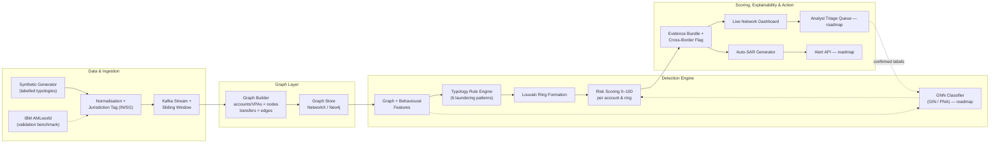

<div align="center">

# MuleMesh 🕸️

### Cross-Border Money-Mule Network Intelligence for the India–Singapore Corridor

**Catch the ring, not the transaction.**

*Singapore–India Hackathon 2026 · Theme: FinTech + InsurTech · Category: Software*
*Team **LogicX** · Abhay Madan, Delhi Technological University*

[**GitHub**](https://github.com/codewithabhay10/mulemesh) · Live demo: _add your Render URL_ · Video: _add your demo link_

</div>

---

## The problem

Money mules don't look suspicious one account at a time. Each transfer is small,
legal-looking, and under every reporting threshold — the crime only appears in the
**shape of the network**. Banks monitor accounts in isolation, so a laundering chain
spread across four banks looks like four ordinary transfers.

It is happening at scale, and it crosses a border that no single regulator can see across:

| Figure | What it means |
|---|---|
| **524,121** | suspected mule accounts flagged in India in a single month (March 2026) |
| **2.47 M+** | Layer-1 mule accounts documented nationwide |
| **USD 2.6 B** | lost by Indians to fraud in 2025, across 2.8 M complaints |
| **0.025%** | of cyber-fraud losses are ever recovered — so detection *after the fact* is nearly worthless |

**The corridor gap.** RBI and MAS are each building domestic defences (e.g. RBI's
MuleHunter.AI), but neither has visibility into laundering that *hops* from an Indian
VPA to a Singapore account. Once funds are layered across the UPI→PayNow rail, they
are effectively unrecoverable. Prevention is the only lever with leverage — and
prevention needs a **network-level, corridor-native** view.

## The solution

MuleMesh models every account/VPA as a node and every transfer as an edge, then scores
the **whole graph** to surface the laundering rings hiding inside the corridor — and
explains every flag in plain regulator language, ending with a filing-ready report.

- **Network-level, not account-level** — finds the ring *and its organising hub*, where
  enforcement actually has leverage, instead of raising thousands of isolated alerts.
- **Corridor-native** — flags cross-border hops (Indian VPA → Singapore account) as
  first-class evidence, not a domestic tool that stops at the border.
- **Explainable by design** — every risk point is attributable to a named rule, so each
  flag states exactly which laundering pattern fired and at what value.
- **Closes the last mile** — auto-drafts the Suspicious Activity Report for each ring,
  producing the compliance artefact, not just a score.

---

## Results at a glance

The prototype in this repo scans a synthetic six-hour window (default seed 7) and
recovers every injected laundering ring with zero false positives:

| Accounts | Transactions | Rings found | Value flagged | Precision | Recall |
|:---:|:---:|:---:|:---:|:---:|:---:|
| **277** | **642** | **3 / 3** | **₹68.8 L** | **100%** | **100%** |

The three rings it recovers — exactly what the on-screen dossiers show:

| Ring | Typology | Risk | Size | Value moved |
|---|---|:---:|---|---:|
| **RING-001** | Fan-in / Fan-out Mule Hub | 79 | 9 accounts (14 senders fan in) | ₹7.2 L |
| **RING-002** | Layering Chain | 90 | 6 accounts | ₹43.6 L |
| **RING-003** | Smurfing / Structuring Network | 73 | 12 accounts | ₹18.0 L |

Every ring flows one-way, **India → Singapore**.

> 100% synthetic data — no real accounts, no database. The entire world lives in memory,
> so the whole demo runs offline with no API key.

---

## What's built in this repo

This repository is the **working prototype** that proves the core detection engine and
the analyst experience end-to-end. It is deliberately scoped for a hackathon demo:

| Area | In this prototype | Production roadmap (see [Architecture](#architecture)) |
|---|---|---|
| **Data** | Synthetic generator with labelled typologies | Live bank feeds + IBM AMLworld validation |
| **Ingestion** | Precomputed six-hour window, replayed client-side | Kafka stream, sliding-window incremental updates |
| **Graph store** | NetworkX, in-memory | Neo4j for scale + persistence |
| **Detection** | Typology rule engine + Louvain community detection | Add GNN classifier (GIN / PNA) for dual detection |
| **Scoring** | 0–100, fully rule-attributable | Rules **+** GNN, retrained on analyst-confirmed labels |
| **Output** | Ring dossier, explainability panel, template SAR (+ optional Claude polish) | Analyst triage queue, Alert API, federated RBI–MAS signal sharing |

Everything under **"In this prototype" is real and runs today.** The roadmap column is
the proposed production platform from the pitch, not implemented here.

---

## Quick start

**One command** — creates a venv, installs deps, starts the API on `:8000`, and opens
the UI at http://localhost:5173:

```powershell
cd mulemesh
.\run.ps1        # Windows
```
```bash
cd mulemesh
./run.sh         # macOS / Linux
```

<details>
<summary>Manual start (two terminals)</summary>

```bash
# terminal 1 — backend
pip install -r backend/requirements.txt
python -m uvicorn backend.app.main:app --port 8000    # note: python -m, not bare uvicorn

# terminal 2 — frontend
cd frontend && npm install && npm run dev
```
</details>

Regenerate the dataset and print the detection summary:

```bash
python backend/seed.py           # default seed 7 → writes backend/data.json
python backend/seed.py 42        # any other seed
```

---

## The 60-second demo

1. **Two live views.** Open on the satellite **🛰 Corridor** map — Indian accounts over
   real metros, Singapore on the island, gold arcs of legitimate remittance drifting
   India → Singapore. Toggle to **◉ Network** for the force-directed graph anytime; both
   share Play, detection, and dossiers.
2. **Inspect one account first.** Click any node — risk 0, *"no typology rules triggered."*
   In isolation, mules look clean. That's the whole point.
3. **Hit ▶ Play.** Six hours of transactions stream in over ~15 seconds. Three clusters
   assemble and **flash red** as each ring completes; the top bar counts rings and flagged
   value as they land.
4. **Open a ring.** The dossier shows the risk dial, typology, the exact rules that fired
   (with weights and evidence), member accounts, and an auto-generated **Suspicious
   Activity Report** — ready to file.
5. **Replay.** Same data, same clock, same rings in the same order. Detection is
   deterministic: no model drift, no random seed to chase.

---

## How detection works — no black box

Per-node graph features → weighted typology rules → a 0–100 risk score where **every
point is attributable to a named rule.**

- **Graph & behavioural features:** in/out degree (unique counterparties), fan-in/fan-out
  ratio, betweenness centrality, transaction velocity (max txs per 30-min window),
  pass-through ratio + holding time, sub-threshold band counts, cross-border flow.
- **Rules (weight):** rapid pass-through layering (50), sub-threshold structuring (45),
  fan-in/fan-out hub (40), cross-border aggregation sink (35), smurf relay (30), large
  cross-border outflow (20), abnormal velocity (15), concentrated fan-in (15),
  betweenness (10).
- **Ring formation:** Louvain community detection partitions the graph; flagged nodes are
  expanded along stream-phase money flow into rings, and ring risk propagates to unflagged
  members (tagged `COMMUNITY_RISK`, so the propagation is visible too).
- **Honest scoring:** precision and recall are measured on detected ring members against
  the injected ground-truth labels — **1.0 / 1.0** on the default seed.

## Suspicious Activity Reports

Every ring exports a **filing-ready SAR** — case reference, jurisdictions, corridor,
typology, the full rule trace, member and victim accounts, and a recommended action —
from a deterministic template. **No API key needed; the demo works fully offline.**

The **✦ Polish with Claude** button optionally POSTs `{"llm": true}`; the backend then
calls the Anthropic API (`claude-opus-4-8`) to rewrite the report in formal regulator
prose. Any missing key or API error falls back to the template unchanged, and the UI
says so — the demo never breaks.

```bash
# optional — only for the Polish button
export ANTHROPIC_API_KEY=...            # PowerShell: $env:ANTHROPIC_API_KEY="..."
```

---

## Architecture

The prototype implements the shaded path below; the rest is the proposed production
platform (streaming ingestion, Neo4j, the GNN half of dual detection, and the shared
RBI–MAS action layer).



## API

| Endpoint | Returns |
|---|---|
| `GET /api/graph` | nodes, links, rings, stats, playback window |
| `GET /api/rings` | detected rings with full rule traces |
| `GET /api/stats` | counters + precision/recall vs ground truth |
| `POST /api/sar/{ring_id}` | `{"llm": false}` template · `{"llm": true}` Claude rewrite |

## Tech stack

**Backend** — FastAPI + NetworkX (in-memory graph, Louvain communities, betweenness
centrality); optional Anthropic API for SAR prose.
**Frontend** — React + Vite; `react-force-graph-2d` for the Network view; Leaflet +
Esri World Imagery satellite tiles (free, no key) with a synced canvas overlay for the
Corridor view.

> The Corridor map streams satellite tiles from Esri, so it needs internet. Offline, it
> falls back to a dark-ocean backdrop and the arcs, nodes, and flags still render —
> nothing else in the demo depends on the network.

## Repository layout

```
mulemesh/
├─ backend/
│  ├─ app/
│  │  ├─ main.py          FastAPI app — API routes + serves the built UI
│  │  ├─ generator.py     synthetic graph + injected laundering typologies
│  │  ├─ detection.py     graph features, weighted rules, Louvain, scoring
│  │  └─ sar.py           SAR template + optional Claude polish
│  ├─ seed.py             regenerate dataset, print summary → data.json
│  └─ requirements.txt
├─ frontend/src/          React UI (Corridor + Network views, dossier, SAR)
├─ brand/                 logo + mark exports (SVG / PNG)
├─ Dockerfile            single-image build (Node builds UI → Python serves it)
├─ render.yaml            one-click Render blueprint (repo root)
└─ run.ps1 / run.sh       one-command local launchers
```

## Deploy

The whole app ships as **one container**: Node builds the React UI, then a slim Python
image serves both the API and the static UI from a single process.

```bash
# serve UI + API from FastAPI on one port
cd frontend && npm run build            # writes frontend/dist
python -m uvicorn backend.app.main:app --port 8000     # → http://localhost:8000

# or build the image directly
docker build -t mulemesh .
docker run -p 8000:8000 mulemesh
```

`render.yaml` in the repo root is a one-click [Render](https://render.com) blueprint
(free plan, Singapore region, health check on `/api/stats`). No API key is required to
run the full demo; add `ANTHROPIC_API_KEY` in the Render dashboard only for Claude-polished SARs.

---

## Feasibility & impact

**Feasibility.** Every component is open-source and mature (NetworkX/PyTorch Geometric,
Neo4j, FastAPI, React). The synthetic-first design removes the data-access blocker
entirely, and the system deploys as a **consortium layer above existing bank systems** —
no core-banking replacement, adopted through a single analyst dashboard. Estimated Year-1
MVP cost ≈ **₹3–4.5 L (~4,000–6,000 SGD)**, mostly one-time development.

**Grounded in reality.** RBI's MuleHunter.AI (built on 19 mule-behaviour patterns) is
already live at 23 banks with Canara Bank reporting 95% accuracy — proving the premise at
scale. MAS's **Facility Restriction Framework** (Oct 2025) gives the enforcement mechanism
this feeds. MuleMesh extends that proven idea to the *corridor* and is exportable to other
high-volume rails (India–UAE, India–UK) and to insurance-fraud rings.

**Who benefits.** Banks/fintechs get fewer, ring-level, explained alerts. AML analysts get
automated SAR drafting and start from a whole ring, not scattered accounts. RBI and MAS get
a first shared operational view of the corridor. And migrant workers and students — often
recruited as mules without understanding it — are protected as both victims and unwitting
participants, since network-level detection targets ring *organisers* rather than endpoints.

<details>
<summary>Selected references</summary>

- RBI MuleHunter.AI — [Business Standard](https://www.business-standard.com/finance/news/what-is-mulehunter-ai-rbi-s-latest-tool-against-financial-fraud-explained-124120600865_1.html) · [23-bank RTI, Medianama](https://www.medianama.com/2025/12/223-rti-23-banks-mulehunter-mule-accounts/)
- India's mule problem — [FrankOnFraud](https://frankonfraud.com/india-has-a-money-mule-problem-there-are-2-5-million-of-them/) · [the420.in (Mar 2026)](https://the420.in/india-mule-accounts-upi-fraud-march-2026-report/)
- MAS Facility Restriction Framework — [SPF/MAS/IMDA/GovTech joint release (2025)](https://www.mas.gov.sg/news/media-releases/2025/joint-press-release-by-spf-mas-imda-and-govtech-on-restricting-access-to-facilities-for-scam-mules)
- UPI–PayNow corridor — [FintechNews SG](https://fintechnews.sg/114184/fintech-india/upi-paynow/)
- IBM AMLworld dataset (NeurIPS 2023) — [paper](https://proceedings.neurips.cc/paper_files/paper/2023/file/5f38404edff6f3f642d6fa5892479c42-Paper-Datasets_and_Benchmarks.pdf) · [AMLSim](https://github.com/IBM/AMLSim)
- Libraries — [NetworkX](https://networkx.org/documentation/stable/) · [PyTorch Geometric](https://pytorch-geometric.readthedocs.io) · [Neo4j](https://neo4j.com/docs/)

</details>
